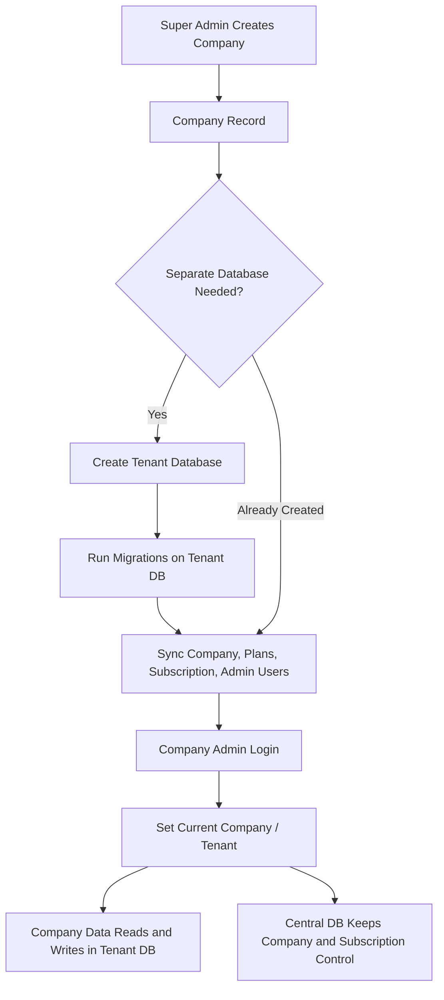
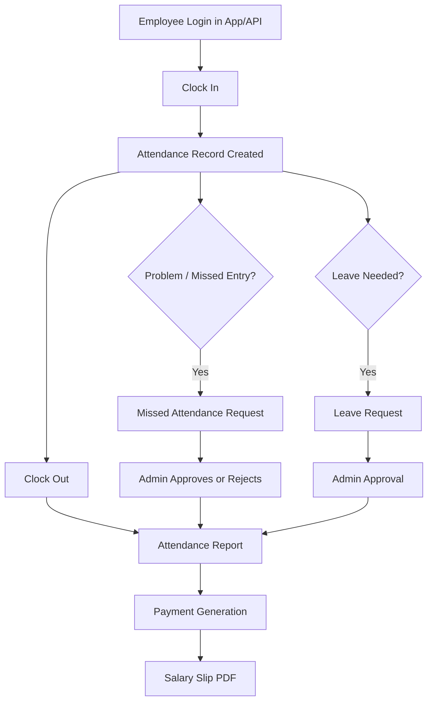
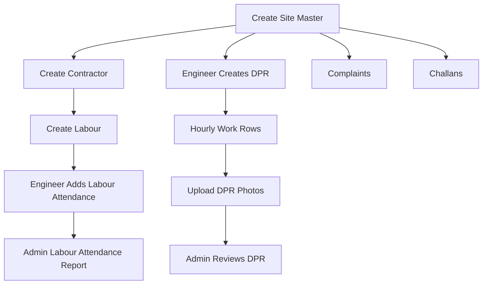
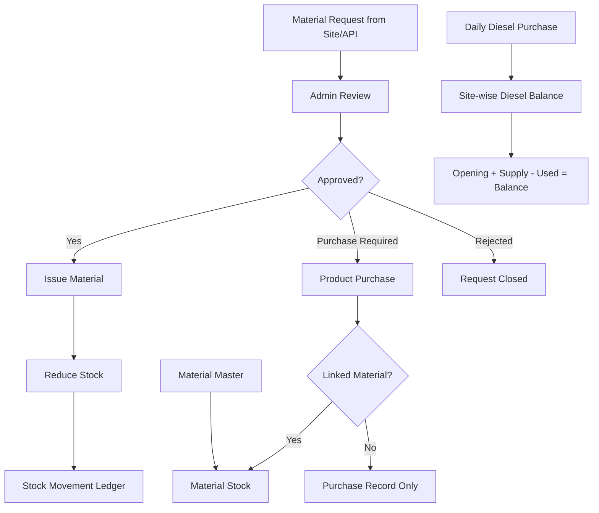
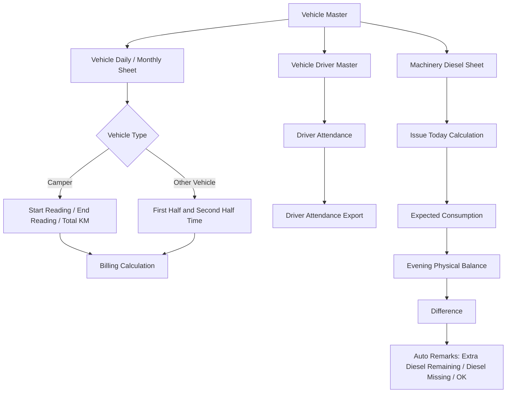

# Attendance API / Admin ERP Flowcharts and ERD

Generated from the local Laravel project in `C:\xampp\htdocs\attendance_api`.

This file uses Mermaid diagrams. You can open it in any Mermaid-supported Markdown viewer, or paste each diagram into https://mermaid.live.

## 1. Simple ERP Module Flow

```mermaid
flowchart TD
    A[Admin / Company Login] --> B[Dashboard]
    B --> C[HR]
    B --> D[Masters]
    B --> E[Site Work]
    B --> F[Purchase]
    B --> G[Stock]
    B --> H[Fleet]
    B --> I[Quality]

    C --> C1[Employees]
    C --> C2[Employee Attendance]
    C --> C3[Leave Requests]
    C --> C4[Missed Requests]
    C --> C5[Payments / Salary Slips]
    C --> C6[Driver Attendance]

    D --> D1[Site Master]
    D --> D2[Contractor Master]
    D --> D3[Labour Master]

    E --> E1[DPR Reports]
    E --> E2[Complaints]
    E --> E3[Challans]

    F --> F1[Diesel Purchase]
    F --> F2[Product Purchase]
    F --> F3[Challans]

    G --> G1[Material Master]
    G --> G2[Stock List]
    G --> G3[Material Requests]
    G --> G4[Material Issues]
    G --> G5[Stock Movement History]

    H --> H1[Vehicles]
    H --> H2[Vehicle Daily Sheet]
    H --> H3[Vehicle Drivers]
    H --> H4[Machinery Diesel]

    I --> I1[FDD Test Records]
    I --> I2[MIR File Reports]
```

## 2. Company / Tenant Database Flow

## 3. Employee Attendance and Salary Flow

## 4. Labour, Site Work, and DPR Flow

## 5. Purchase, Stock, and Material Flow

## 6. Fleet, Vehicle Sheet, Driver Attendance, and Machinery Diesel Flow

## 7. Main Model ERD

```mermaid
erDiagram
    COMPANY ||--o{ USER : has
    COMPANY ||--o{ COMPANY_SUBSCRIPTION : has
    SUBSCRIPTION_PLAN ||--o{ COMPANY_SUBSCRIPTION : used_by

    USER ||--o{ ATTENDANCE : marks
    USER ||--o{ PAYMENT : receives
    USER ||--o{ MISSED_ATTENDANCE_REQUEST : raises
    USER ||--o{ DAILY_PROGRESS_REPORT : creates
    USER ||--o{ COMPLAINT : raises
    USER ||--o{ CHALLAN : creates

    LABOUR_SITE ||--o{ CONTRACTOR : has
    CONTRACTOR ||--o{ LABOUR : has
    LABOUR_SITE ||--o{ LABOUR_ATTENDANCE : used_in
    CONTRACTOR ||--o{ LABOUR_ATTENDANCE : used_in
    LABOUR ||--o{ LABOUR_ATTENDANCE : marked_for
    USER ||--o{ LABOUR_ATTENDANCE : engineer_submits

    DAILY_PROGRESS_REPORT ||--o{ DAILY_PROGRESS_REPORT_HOUR : has
    DAILY_PROGRESS_REPORT_HOUR ||--o{ DAILY_PROGRESS_REPORT_PHOTO : has

    FDD_ROAD_SECTION ||--o{ FDD_TEST_RECORD : has

    VEHICLE ||--o{ VEHICLE_LOG : has
    VEHICLE ||--o{ VEHICLE_DRIVER : has
    VEHICLE ||--o{ VEHICLE_DRIVER_ATTENDANCE : has
    VEHICLE_DRIVER ||--o{ VEHICLE_DRIVER_ATTENDANCE : marked_for

    DAILY_DIESEL_PURCHASE ||--o{ DAILY_DIESEL_PURCHASE_SITE_ENTRY : has
    LABOUR_SITE ||--o{ DAILY_DIESEL_PURCHASE_SITE_ENTRY : receives
    LABOUR_SITE ||--o{ MACHINERY_DIESEL_LOG : used_in
    USER ||--o{ MACHINERY_DIESEL_LOG : engineer_submits

    MATERIAL ||--o{ MATERIAL_STOCK : has
    LABOUR_SITE ||--o{ MATERIAL_STOCK : stores_at
    MATERIAL ||--o{ MATERIAL_REQUEST : requested
    USER ||--o{ MATERIAL_REQUEST : requests
    LABOUR_SITE ||--o{ MATERIAL_REQUEST : needed_at
    MATERIAL_REQUEST ||--o{ MATERIAL_ISSUE : issues
    MATERIAL ||--o{ MATERIAL_ISSUE : issued
    MATERIAL ||--o{ STOCK_MOVEMENT : moves
    LABOUR_SITE ||--o{ STOCK_MOVEMENT : site

    MATERIAL ||--o{ PRODUCT_PURCHASE : linked_to
    LABOUR_SITE ||--o{ PRODUCT_PURCHASE : purchased_for
```

## 8. Non-Technical Reading Guide

- Company is the customer/business using this system.
- User is any person who logs in, such as employee, engineer, or admin.
- Site, contractor, and labour are the field-work master records.
- Attendance and labour attendance are separate because employees and contractor labour are tracked differently.
- DPR means Daily Progress Report, used for site work photos and hourly progress.
- Vehicle and vehicle log track vehicle usage, KM, diesel and billing.
- Vehicle driver attendance is for drivers assigned to vehicles.
- Diesel purchase tracks diesel bought and site-wise diesel balance.
- Machinery diesel tracks diesel issued to machinery and automatically shows missing/extra diesel.
- Product purchase and material stock connect purchases to available stock.
- Stock movement is the audit/history of every stock increase or decrease.
